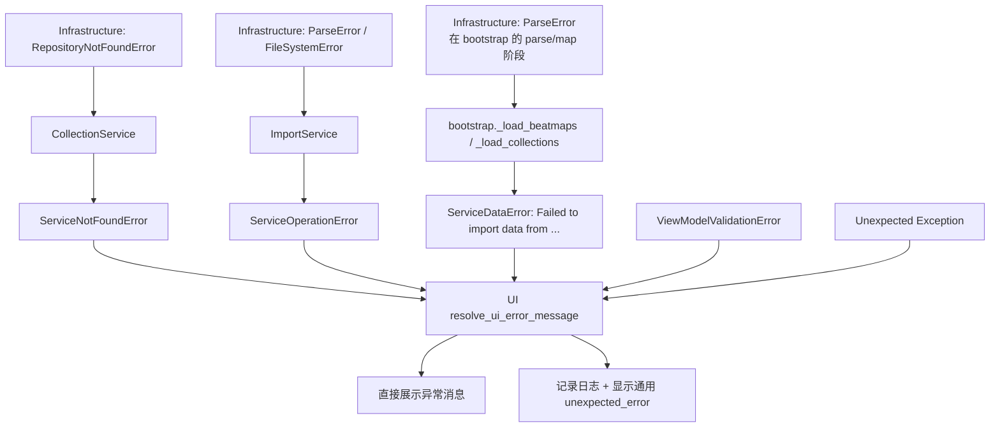

# Exception Design

本文档记录当前代码库中对外有意义的异常种类、层级关系，以及各层之间的异常翻译规则。

目标不是列出每一个 `raise` 语句，而是说明当前项目把哪些异常当作稳定边界，以及这些异常分别承担什么控制流职责。

## 设计原则

当前异常设计遵循三条规则：

1. 先保留边界，再压平细分类型。
2. 只保留有控制流价值的异常类别。
3. 不把“更具体的命名”误当成“更好的建模”。

这意味着：

- UI 层需要区分“预期失败”和“非预期失败”。
- Service 层需要区分校验、冲突、未找到、数据问题、运行失败。
- Infrastructure 层只保留文件系统、解析、仓储这几个边界，避免按实体或按动作继续细分。

## 当前层级总览

```text
Exception
|- ViewModelError
|  `- ViewModelValidationError
|
|- ServiceError
|  |- ServiceValidationError
|  |- ServiceConflictError
|  |- ServiceNotFoundError
|  |- ServiceDataError
|  `- ServiceOperationError
|
|- RepositoryError
|  `- RepositoryNotFoundError
|
|- ParseError
`- FileSystemError
```

## UI 层异常

定义位置：`src/CollectionManager/ui/exceptions.py`

### `ViewModelError`

- 语义：UI / ViewModel 侧的预期失败。
- 用途：让 UI 可以直接把异常消息展示给用户，而不是进入“未知错误”分支。
- 当前消费方式：`resolve_ui_error_message()` 会把 `ViewModelError` 视为 expected error，直接返回 `str(exc)`。

### `ViewModelValidationError`

- 语义：用户在 UI 上发起了不合法操作，但还没进入 service 调用。
- 典型场景：未选择集合、未选择 beatmap、输入空名称。
- 当前主要抛出位置：`src/CollectionManager/ui/viewmodels.py`

### UI 层的消费规则

`resolve_ui_error_message(exc, unexpected_message, log_context)` 的规则是：

- `ServiceError` 或 `ViewModelError`：直接显示异常文本。
- 其他异常：记录日志，并显示通用错误消息。

因此，UI 层当前只关心“是不是 expected error”，并不关心更细的 domain / infrastructure 类型。

## Service 层异常

定义位置：`src/CollectionManager/domain/exceptions.py`

### `ServiceError`

- 语义：service 边界上的基础异常。
- 用途：给 UI、bootstrap、其他调用者提供统一的“预期服务失败”判定。

### `ServiceValidationError`

- 语义：service 级输入不满足业务约束。
- 典型场景：重命名集合时新旧名称相同。
- 当前控制流价值：调用方通常可以直接提示用户修改输入。

### `ServiceConflictError`

- 语义：请求与现有数据冲突。
- 典型场景：创建集合、导入集合、合并集合、重命名集合时名称冲突。
- 当前控制流价值：调用方可以把它作为 expected conflict 展示给用户。

### `ServiceNotFoundError`

- 语义：调用的业务对象不存在。
- 典型场景：
  - 请求的 collection 不存在。
  - 请求删除的 beatmap 不存在。
  - 删除 beatmap 时传入了缺失 hash。
- 主要来源：
  - `RepositoryNotFoundError` 在 `CollectionService` 中被翻译为 `ServiceNotFoundError`。
  - service 本身也会直接构造，例如 `_require_beatmaps()` 发现缺失 hash 时。

### `ServiceDataError`

- 语义：预期的数据/文件输入问题，通常对用户是可理解、可修复的。
- 典型场景：
  - 导入路径缺少 `osu!.db` 或 `collection.db`。
  - 导入文件后缀不正确。
  - `parse_*` / `map_*` / decoder 失败后，bootstrap 将其包装成“导入数据失败”。
  - 导出 `collection.db` 时出现 `OSError`。
  - startup 选择“使用已有数据库”但缓存不存在。
- 当前控制流价值：UI 会把它当成 expected error，直接展示给用户。

### `ServiceOperationError`

- 语义：非预期运行失败，已经到达 service 或 app 边界。
- 典型场景：
  - repository 调用出现未预料的内部错误。
  - import service 在提取、解码、安装流程中遇到异常。
  - service 内部执行流程失败，但不属于 validation/conflict/not-found/data 这几类。
- 当前控制流价值：UI 仍把它当 expected `ServiceError` 展示，但语义上它表示系统侧故障，而不是用户输入问题。

## Infrastructure 层异常

### 文件系统边界

定义位置：`src/CollectionManager/infrastructure/exceptions/fs.py`

#### `FileSystemError`

- 语义：文件系统相关基础设施操作失败。
- 额外字段：`path`
- 当前主要抛出位置：
  - `src/CollectionManager/infrastructure/fs/osz_extractor.py`
  - `src/CollectionManager/infrastructure/fs/bm_installer.py`
- 典型场景：
  - `.osz` 不是合法 zip。
  - 源目录不存在或不是目录。
  - 复制 beatmap 目录失败。

当前没有再保留 `ExtractionError`、`BeatmapInstallError` 之类的细分类，因为调用方不会按这些具体类型分支。

### 解析边界

定义位置：`src/CollectionManager/infrastructure/exceptions/parser.py`

#### `ParseError`

- 语义：解析、映射、beatmap 解码过程中发生失败。
- 额外字段：
  - `pos`: 二进制解析位置，适用于 `osu!.db` / `collection.db`
  - `context`: 附近上下文，通常是十六进制片段或当前文本行
  - `path`: 失败文件路径，适用于 `.osu` 解码
  - `line_number`: 失败行号，适用于 `.osu` 解码
  - `details`: 附加结构化信息
- 当前主要抛出位置：
  - `src/CollectionManager/infrastructure/osu/osu_db_parser.py`
  - `src/CollectionManager/infrastructure/osu/collection_db_parser.py`
  - `src/CollectionManager/infrastructure/osu/bm_decoder.py`
  - `src/CollectionManager/infrastructure/osu/mapper.py`

当前 `ParseError` 覆盖了三类以前分开的故障：

- 二进制 parse failure
- `.osu` 文件 decode failure
- 映射时缺字段或结构不满足预期

当前不再保留 `MissingFieldError`、`BeatmapDecodeError` 等细分类，因为调用方不对这些子类做不同分支。

### 仓储边界

定义位置：`src/CollectionManager/infrastructure/exceptions/repository.py`

#### `RepositoryError`

- 语义：持久化层基础异常。
- 当前主要作用：作为仓储边界上的总类保留层级语义。

#### `RepositoryNotFoundError`

- 语义：repository lookup / mutation 命中了不存在的记录。
- 当前主要抛出位置：
  - `src/CollectionManager/infrastructure/storage/repositories/collection_repository.py`
  - `src/CollectionManager/infrastructure/storage/repositories/beatmap_repository.py`
- 典型场景：
  - `get()` 查不到集合或 beatmap。
  - `delete()` 目标不存在。
  - `rename()`、`add_beatmaps()`、`remove_beatmaps()` 目标集合不存在。

当前不再保留 `CollectionNotFoundError`、`BeatmapNotFoundError` 这类按实体拆开的仓储异常，因为上层只关心 “not found”。

## 跨层翻译关系

### Infrastructure -> Service

#### Repository -> Service

`CollectionService` 会把 `RepositoryNotFoundError` 翻译为 `ServiceNotFoundError`。

典型位置：

- `_require_collection()`
- `delete_collection()`
- `delete_beatmap()`
- `rename_collection()`
- `add_beatmaps_to_collection()`
- `remove_beatmaps()`

翻译规则很直接：

- 保留原消息文本。
- 日志按 expected failure 记录 warning。
- 再抛出 `ServiceNotFoundError`。

#### FileSystem / Parse -> ServiceOperation

`ImportService` 不把 infrastructure 细节直接向上暴露，而是把提取、解码、安装中的任何异常统一包装为 `ServiceOperationError`。

这意味着：

- `.osz` 提取失败，不需要上层知道是不是 `FileSystemError`。
- `.osu` 解码失败，不需要上层知道是不是 `ParseError`。
- 安装到 Songs 目录失败，也统一进入 service 运行失败语义。

这条边界的目的，是把 import pipeline 视为一个 service 操作，而不是暴露内部步骤细节。

### Infrastructure / Service -> App Bootstrap

`src/CollectionManager/app/bootstrap.py` 是另一层重要翻译边界。

主要规则：

- 读取/解析/映射导入文件失败：包装为 `ServiceDataError`
- service 返回 `ServiceError`：按语义继续上抛，或重新包装成更具体的导入错误消息
- 非预期异常：包装为 `ServiceOperationError`

具体表现：

- `_load_beatmaps()` 和 `_load_collections()` 在解析阶段发生的任何异常，都会变成 `ServiceDataError("Failed to import data from ...")`
- `load_initial_data()` 在最外层只允许 `ServiceError` 直接透出，其他异常统一转成 `ServiceOperationError`
- `import_beatmap_packages()` 和 `import_collection_db()` 也遵循同样规则

因此 bootstrap 负责把低层解析/文件输入问题，改写成用户可理解的导入错误。

### Service / ViewModel -> UI

UI 当前不再按具体 service 子类做分叉处理。

统一规则由 `resolve_ui_error_message()` 提供：

- `ServiceError` 和 `ViewModelError`：直接展示消息
- 其他异常：记录日志，展示 `main.unexpected_error` 或 `startup.unexpected_error`

这让 UI 只承担“展示 expected message / 隐藏 unexpected internals”的职责，不承担业务异常分类职责。

## 异常流转示意图

下面这张图描述的是当前最常见的异常传播路径，而不是所有边角分支。



如果按调用层次展开，可以把它理解成下面这条总线：

```text
Infrastructure
  |- RepositoryNotFoundError ---------> CollectionService ---------> ServiceNotFoundError
  |- ParseError / FileSystemError ----> ImportService -------------> ServiceOperationError
  `- ParseError (bootstrap parse/map) -> bootstrap ----------------> ServiceDataError

ViewModel
  `- ViewModelValidationError -------------------------------------> UI expected error

UI
  |- ServiceError / ViewModelError -> 直接显示消息
  `- 其他异常 -----------------------> 记录日志 + 显示通用错误
```

### 三条最重要的流转路径

#### 1. 资源不存在

```text
RepositoryNotFoundError
-> CollectionService 捕获并翻译
-> ServiceNotFoundError
-> UI 直接展示消息
```

这个路径对应“集合不存在”“beatmap 不存在”这类 expected failure。

#### 2. 导入输入有问题

```text
ParseError / map 失败 / 文件缺失
-> bootstrap 包装
-> ServiceDataError
-> UI 直接展示导入失败消息
```

这个路径对应“osu!.db 缺失”“collection.db 非法”“导入文件格式异常”这类可解释的数据问题。

#### 3. 导入流程内部故障

```text
FileSystemError / ParseError / 其他异常
-> ImportService 包装
-> ServiceOperationError
-> UI 直接展示 service 失败消息
```

这个路径表达的是“导入动作本身失败”，而不是用户给了错误输入。

## 当前 public surface 与 internal detail 的边界

从调用约定上看，当前更推荐把下面这些视为稳定边界：

- UI: `ViewModelError`
- Domain: `ServiceError`
- Infrastructure repository: `RepositoryError`
- Infrastructure parsing: `ParseError`
- Infrastructure fs: `FileSystemError`

而下面这些更像内部实现细节，不建议继续向外扩散：

- Rust parser backend 自己抛出的 `RustBackendParseError`
- 第三方库原生异常，如 `OSError`、`ValueError`、zipfile 异常、construct 异常

这些内部异常应该尽量在边界处被收敛或翻译，而不是直接成为上层 contract。

## 新增异常时的约束

新增异常前，先回答两个问题：

1. 调用方会不会因为这个新类型写出新的 `except` / `isinstance` 分支？
2. 如果不会，这个类型是否只是比现有类型“名字更具体”？

如果第 1 个问题答案是否定的，通常不该新增子类。

当前推荐做法：

- 需要表示新的 service 级控制流语义时，优先放到 `ServiceError` 子类层。
- 需要表示新的 infrastructure 边界时，优先新增“边界类”，而不是“动作类”或“实体类”。
- 如果只需要携带更多调试信息，优先给现有异常补字段，而不是新建一层子类。

## 当前结论

- UI 只关心 expected vs unexpected。
- Service 只关心 validation / conflict / not found / data / operation。
- Infrastructure 只关心 fs / parser / repository 边界。
